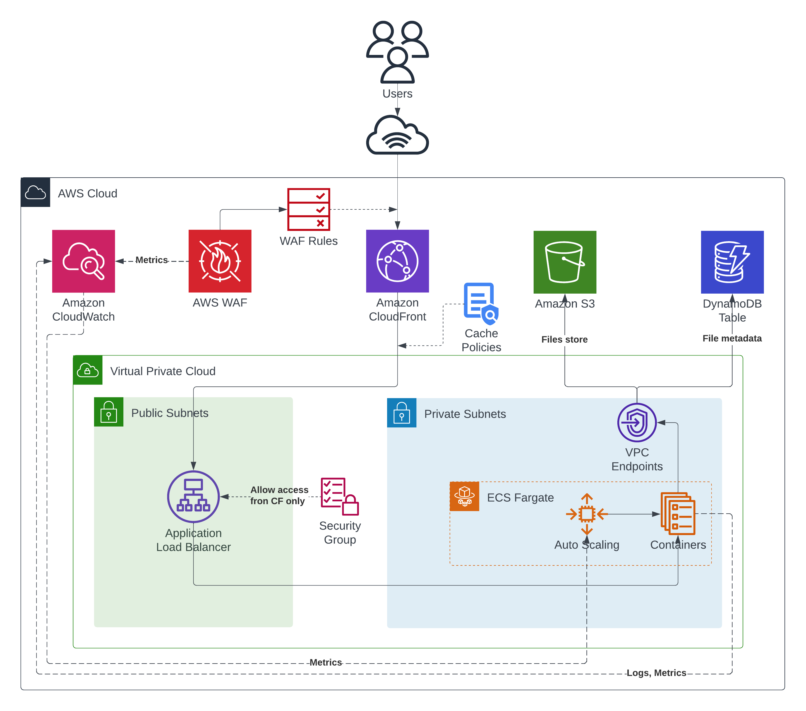

# Architecture Design 

The architecture design utilizes various AWS services effectively to provide a secure, scalable, and high-performance application. The following diagram illustrates the overall architecture of the application

There are main components as follows:

1. **CloudFront Distribution**: Acting as a Content Delivery Network (CDN), the CloudFront distribution serves as the entry point to the application. Users access the application via edge locations that are geographically closer to them, ensuring reduced latency and improved user experience.

2. **WAF Web ACL**: The CloudFront distribution is associated with a Web Application Firewall (WAF) Web ACL, which enforces security limitations such as request rate limits and upload sizes. It also protects against potential exploits and enhances overall security

3. **Application Load Balancer (ALB)**: Following the security checks at the WAF Web ACL, the traffic is directed to an internet-facing ALB residing within a Virtual Private Cloud (VPC). While the ALB is publicly accessible, it is exclusively accessible from CloudFront IP ranges. This ensures that only authorized requests from CloudFront can access the ALB, providing an additional layer of security

4. **ECS Fargate for Container Orchestration**: The ALB forwards traffic to numerous containers, which host the main application. These containers are orchestrated by ECS Fargate, a serverless container orchestration service. The application's containers are automatically scaled based on demand, utilizing Auto Scaling to handle fluctuating workloads

5. **S3 and DynamoDB for Data Storage**: The application relies on S3 as the main storage for files, while a DynamoDB table is used for storing metadata. To enhance data security, encryption at rest is employed for both S3 and DynamoDB. All communication between the containers and these storage services occurs within the AWS network using VPC endpoints. This ensures secure and low-latency data transfers. 

6. **Centralized Logging and Metrics with CloudWatch**: CloudWatch serves as the centralized location for storing logs and metrics of all the components. It provides a single source of truth for monitoring and troubleshooting. Additionally, CloudWatch can be easily integrated with other AWS services for seamless monitoring

7. **Subnet and Security Group Configuration**: The VPC hosting the ALB and Fargate tasks is designed with both public and private subnets to ensure high availability and fault tolerance. Security groups are carefully configured to control inbound and outbound traffic between resources, minimizing potential attack vectors.
